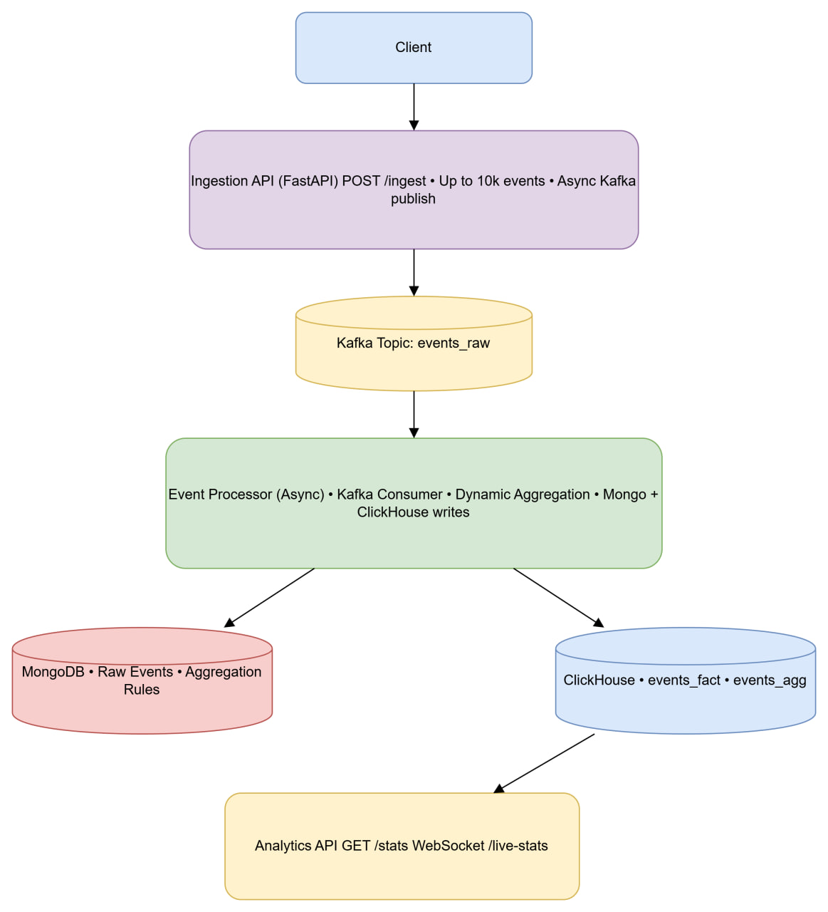

# 🚀 Real-Time Streaming Analytics with Dynamic Rules

This repository contains a **production-grade real-time streaming analytics system** built with **FastAPI, Kafka, MongoDB, ClickHouse, and WebSockets**.

The system is designed to ingest **high-volume event data**, process it asynchronously, apply **dynamic aggregation rules without restarts**, and expose analytics via **HTTP APIs and real-time WebSocket streams**.

---

# 1️⃣ Architecture Diagram (System Design)

The architecture below reflects the **actual runtime behavior of the code in this repository**.




### Key Architectural Decisions
- **Kafka** decouples ingestion from processing
- **MongoDB** stores flexible schemas (raw events, rules)
- **ClickHouse** handles analytical workloads efficiently
- **WebSockets** provide true real-time analytics (no polling)
- Aggregation rules are **hot-reloaded** (no restarts)

---

# 2️⃣ How to Run Locally (Step-by-Step)

## Prerequisites
- Docker ≥ 24
- Docker Compose v2

## Start All Services
```bash
docker compose up --build -d
```

## Services & Ports

| Service | Address                     |
|------|-----------------------------|
| Ingestion API | http://localhost:8000/docs/ |
| Analytics API | http://localhost:8001/docs/ |

## Verify Containers
```bash
docker ps
```

All services must be in **running** state before testing.

---

# 3️⃣ API Reference (Exact Requests & Responses)

This section documents **every public endpoint**, exactly as implemented.

---

## 🔹 POST `/ingest` — Event Ingestion API

### Purpose
Accepts large batches of events and publishes them to Kafka **asynchronously**.
The API does **not wait** for Kafka acknowledgements, ensuring low latency.

### Request
```
POST /ingest
Content-Type: application/json
```

### Request Body
- Type: `array`
- Max size: **10,000 events per request**

```json
[
  {
    "event_id": "uuid-1",
    "user_id": "user_123",
    "event_type": "click",
    "timestamp": "2026-01-13T10:00:00Z",
    "payload": {
      "product_id": 42,
      "price": 19.99
    }
  }
]
```

### Response
```json
{
  "status": "accepted",
  "count": 1
}
```

### Guarantees
- Batch size validation
- Fire-and-forget Kafka publish
- Consistent sub-10ms API latency under load

---

## 🔹 POST `/aggregation-rule` — Dynamic Aggregation Rules

### Purpose
Defines aggregation logic that can be **added, modified, or disabled at runtime**.

### Request
```json
{
  "rule_id": "top_events_10m",
  "window_size": "10m",
  "metric": "count",
  "group_by": ["event_type"],
  "active": true
}
```

### Behavior
- Stored in MongoDB
- Periodically reloaded by the scheduler
- No service restart required

---

## 🔹 GET `/stats` — Analytics Query API

### Purpose
Fetches aggregated analytics from ClickHouse.

### Request
```
GET /stats?rule_id=rule_10m_event_type
          &start_time=2026-01-17T00:00:00Z
          &end_time=2026-01-18T00:00:00Z

```

### Response
```json
{
  "rule_id": "rule_10m_event_type",
  "from": "2026-01-17T00:00:00+00:00",
  "to": "2026-01-18T00:00:00+00:00",
  "count": 10,
  "data": [
    {
      "window_start": "2026-01-17T19:30:00",
      "event_type": "purchase",
      "value": 463440
    }
  ]
}

```

### Performance
- ClickHouse optimized queries
- p95 latency **< 300 ms** with large datasets

---

## 🔹 WebSocket `/live-stats` — Real-Time Analytics

### Purpose
Streams real-time analytics updates to clients.

### Client → Server (Subscription)
```json
{
  "subscribe_rules": ["top_events_10m"]
}
```

### Server → Client (Push Message)
```json
{
  "rule_id": "top_events_10m",
  "timestamp": "2026-01-13T17:50:00Z",
  "data": [
    ["2026-01-13T17:50:00", "click", 2082]
  ]
}
```

### Characteristics
- Push interval: **every 5 seconds**
- Fan-out: multiple clients per rule
- Automatic cleanup when clients disconnect

---

# 4️⃣ Performance Benchmarks (Measured)

All benchmarks were executed against the **running Docker environment**.

## Single Large Request
- Events: 10,000
- Time: **0.104 sec**
- Throughput: **~96,000 events/sec**

## Parallel Load Test
- Events: 100,000
- Total time: **3.20 sec**
- Throughput: **~31,000 events/sec**
- Avg latency: **562 ms**
- Errors: **0**

---

# 5️⃣ Testing & Load Testing (Docker-based)

This project includes a fully automated load & integration testing suite, designed to validate:
API availability
Kafka ingestion throughput
End-to-end analytics pipeline correctness
All tests run inside Docker and output results directly to the terminal.

## ▶️ How to Run All Tests
```commandline
docker compose up --build load-test
```
## What Happens Internally
API health is verified
Kafka load is generated (high volume)
Aggregations propagate to ClickHouse
Results are validated
Container exits with success or failure

## Example Terminal Output

======================================
🧪 API TEST START
======================================

API status: 200

✅ API TEST PASSED

======================================
🔥 KAFKA LOAD TEST START
======================================

📤 Sent 0 messages

📤 Sent 1000 messages

📤 Sent 5000 messages

📤 Sent 10000 messages

✅ KAFKA LOAD TEST DONE

======================================
✅ ALL TESTS PASSED
======================================

---

# 🗄️ Data Storage Model

## MongoDB
- `raw_events` — full unmodified event payloads
- `aggregation_rules` — dynamic rule definitions

## ClickHouse
```sql
CREATE TABLE analytics.events_fact (
    event_id String,
    user_id String,
    event_type String,
    timestamp DateTime
) ENGINE = MergeTree
PARTITION BY toDate(timestamp)
ORDER BY (event_type, timestamp);

CREATE TABLE analytics.events_agg (
    rule_id String,
    window_start DateTime,
    event_type String,
    metric_value UInt64
) ENGINE = SummingMergeTree
PARTITION BY toDate(window_start)
ORDER BY (rule_id, window_start, event_type);
```

---

# 🏁 Final Notes

This project demonstrates:

- High-throughput, low-latency ingestion
- Event-driven microservice architecture
- Runtime-configurable analytics
- Real-time WebSocket dashboards
- Scalable, production-ready design

It is suitable for:
- System design interviews
- Backend/Data Engineer portfolios
- Real analytics product foundations
